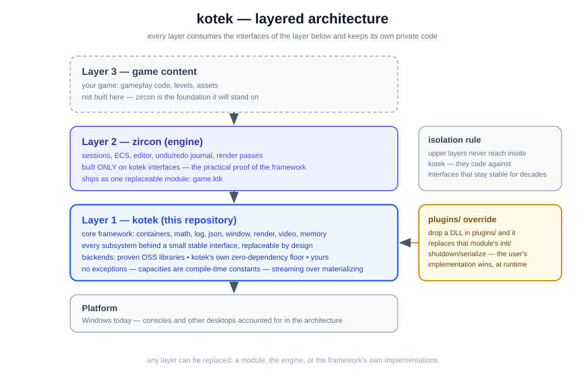
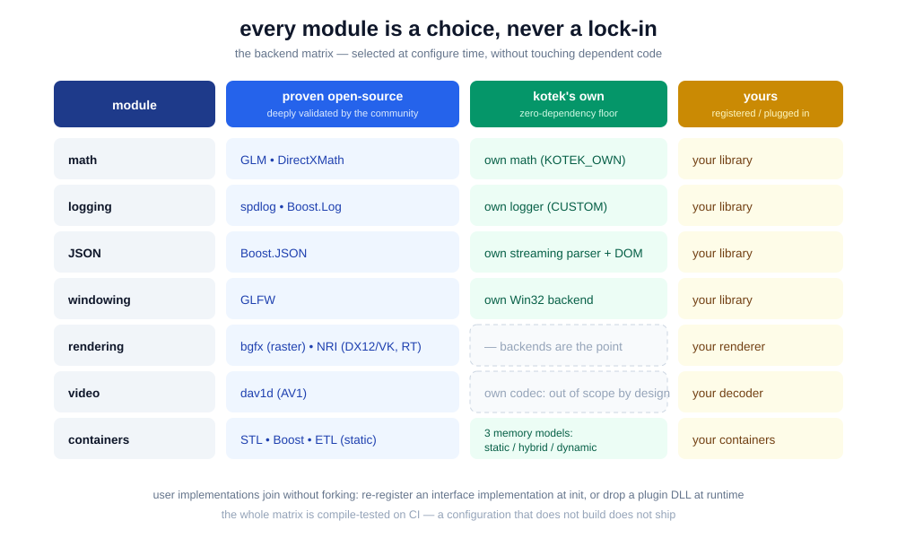
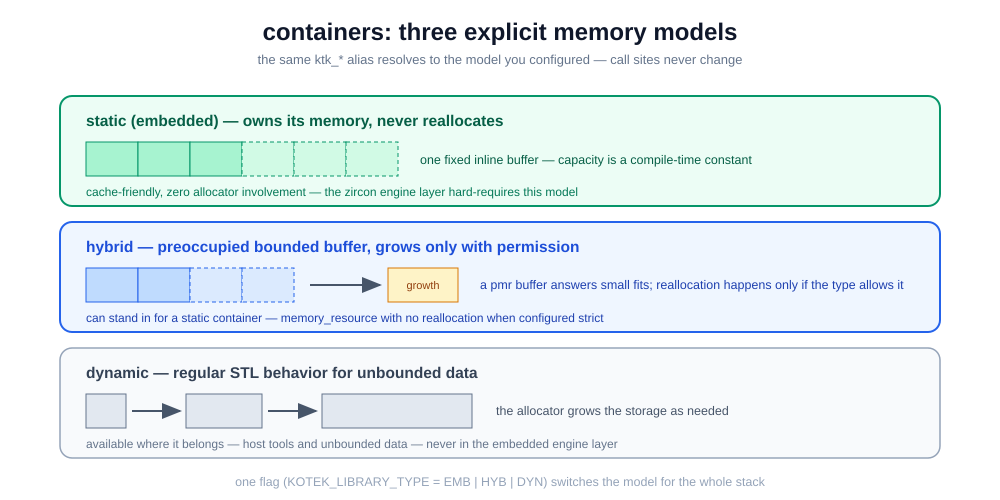
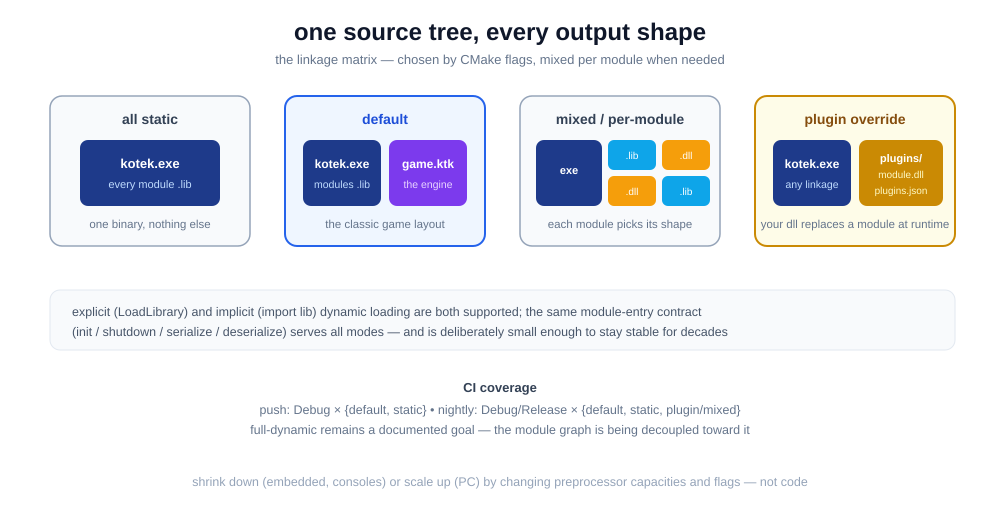

# kotek

[](https://github.com/wh1t3lord/kotek/actions/workflows/build.yml)
[](https://github.com/wh1t3lord/kotek/actions/workflows/modules.yml)
[](https://github.com/wh1t3lord/kotek/actions/workflows/tests.yml)
[](https://github.com/wh1t3lord/kotek/actions/workflows/matrix.yml)

kotek is a modular C++ framework for building game engines and real-time
applications. It is the foundation of a layered stack — **kotek** (core
framework) → **zircon** (game engine) → game content — and is equally suited to
tools, simulations, and other real-time software.

For non-specialists: kotek is the carefully engineered groundwork that lets a
team build an engine of their own — and replace any part of it later without
breaking what already works.

## What kotek standardizes

<p align="center">
  
</p>

- **Interface-first modularity.** Every subsystem — math, logging, JSON,
  containers, windowing, rendering, video, memory — sits behind a small, stable
  interface. Implementations can be re-registered at initialization or replaced
  at runtime by dropping a DLL into `plugins/`, with no changes to dependent
  code. The interface surface is designed to remain unchanged for decades: code
  written against kotek is not meant to become legacy.
- **Switchable backends, with a no-dependency floor.** Modules ship with
  backends built on widely adopted, community-proven libraries (GLM, DirectXMath,
  bgfx, spdlog, Boost, dav1d) **and** with kotek's own zero-dependency
  implementations — its own streaming JSON parser, its own logger, its own Win32
  window backend, its own math. Users may also register their own libraries
  without forking the framework.

<p align="center">
  
</p>

- **Three explicit memory models for containers.** Static (fixed capacity, never
  reallocates), hybrid (bounded buffer, grows only when permitted), and dynamic —
  selected at configure time. Moving between a PC budget and a console/embedded
  budget becomes a build flag, not a rewrite.

<p align="center">
  
</p>
- **A complete output matrix.** The same source builds as one static
  executable, as per-module static/shared mixtures, or as runtime-loadable
  plugins — including the classic layout of a launcher executable plus a single
  game module. (Full dynamic linking is a documented limitation: the module
  graph is intentionally being decoupled toward it.)

<p align="center">
  
</p>
- **A C++/CMake-only toolchain.** No Python, no scripting languages, no
  external generators: every tool in the pipeline is written in C/C++ and built
  by CMake.
- **No exceptions, explicit diagnostics, bounded memory.** Error handling is
  assert/status-based; capacities are named compile-time constants; streaming is
  preferred over materializing data in RAM.

## Why it is interesting

- **For experienced engineers:** the discipline is the point — interface
  stability treated as a design constraint, cross-module memory rules written
  down and enforced, and a backend matrix that is compile-tested on CI rather
  than promised.
- **For students and self-taught developers:** the repository is a readable
  reference architecture of how an engine framework is structured — every
  abstraction exists because a concrete problem demanded it, and the reasoning
  is documented in the repository (`AGENTS.md`, module by module).
- **For teams and managers:** replaceability removes both vendor lock-in and
  abandonment risk. If upstream development of any module — or of kotek itself —
  stops, a community or a team can maintain that part as a plugin without
  waiting for anyone's permission or roadmap.

## How it differs from popular game engines

Unity, Unreal, and Godot are complete production engines with editors, content
pipelines, and marketplaces. kotek is not a competitor to them in features; it
is the layer such products are built *on*. It is closer in spirit to a standard
library for engine construction: smaller, stricter, dependency-lean, designed
for constrained hardware, and committed to never breaking its consumers. If the
goal is to ship a game next quarter, a full engine is the right choice. If the
goal is to *build* an engine, port a classic game, teach engine architecture, or
own the entire stack down to the allocator — that is the problem kotek exists
to solve.

## Status and verification

Windows-first (MSVC, Debug and Release), with the architecture accounting for
other desktop platforms and console-class targets. Every module is
compile-tested in isolation on CI, the backend matrix builds nightly (math /
json / containers / linkage variants), and the functional test suite runs as
part of a real engine boot in the zircon repository.

## Building

Requirements: a C++20 compiler and CMake 3.19.3+.

```
git clone https://github.com/wh1t3lord/kotek.git
cd kotek
mkdir build && cd build
cmake ..
cmake --build .
```

`cmake -DKOTEK_HELP=ON` prints every configuration option with its meaning.
The full reference — CMake options and runtime arguments — lives in
[doc/git/en/configuration.md](doc/git/en/configuration.md).

## About the author

kotek — and the zircon engine built on it — is designed and implemented by a
single engineer ([wh1t3lord](https://github.com/wh1t3lord)): the architecture,
the module and plugin systems, the container library, the build and CI
infrastructure, and the test suites. The project represents sustained,
deliberate systems work: interfaces designed to outlive their implementations,
embedded-grade memory discipline, and a consistent refusal of convenience
dependencies. The name means "cat"; the engineering is entirely serious.
